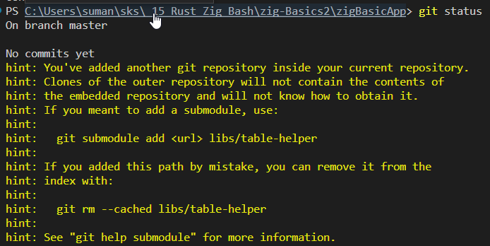

# Intro

- This Basic app is to setup Zig project structure.
- Have Build System in place to add libraries and Git dependencies easily by modifying build.zig.
- Read comments in Build.zig
- Refer some error that can occur once you try to git commit.
- git commit -m "First Commit With setting up Build System and Project structure with lib src"  -

# Errors

- 
